# lab0.5-lab1
## lab0.5
### 为了熟悉使用qemu和gdb进行调试工作,使用gdb调试QEMU模拟的RISC-V计算机加电开始运行到执行应用程序的第一条指令（即跳转到0x80200000）这个阶段的执行过程，说明RISC-V硬件加电后的几条指令在哪里？完成了哪些功能？要求在报告中简要写出练习过程和回答。
填写各个基本练习中要求完成的报告内容：
我们首先可以调用命令：make --always-make V= 来看看make阶段到底都做了什么（V=是用来显示执行命令，--always-make是强制执行更改，即使源文件未被更改）
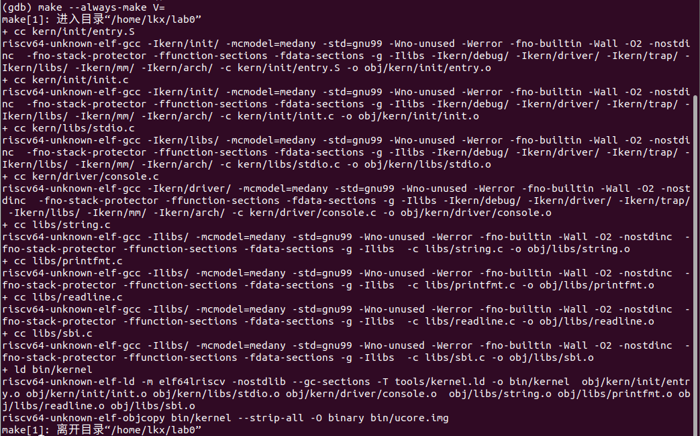
可以看到cc命令将源程序（.c 或 .S）编译为目标文件（.o）仔细看前两行命令：命令中包含了一系列编译选项，用于控制编译器的行为，例如优化级别、警告选项、头文件包含路径等。还包括了一系列 -I 选项，用于指定头文件包含路径，以确保编译器能够找到所需的头文件。

可以看到，我们编译了一系列源程序，而这些源程序便是kernel的所有组成部分。我们将其编译为目标文件后，交给链接器(ld)进行组合生成kernel（ld 链接器通常用于将多个目标文件组合成一个可执行文件，--gc-sections 选项用于删除不被引用的节（sections），以减小生成的可执行文件的大小，-T tools/kernel.ld 指定了链接脚本的路径）。

生成了kernel之后，便开始生成ucore.img，一个完整的ucore镜像文件。

了解这些之后我们可以开始调试ucore，在lab0目录下打开两个终端，一个终端输入“make debug”，另一个终端输入“make gdb”，就可以开始调试了。

首先输入backtrace（"backtrace" 可以用于捕获当前线程的调用堆栈信息，通常包括函数名称、文件名和行号等信息。）发现没有栈信息(显示Backtrace stopped: previous frame identical to this frame (corrupt stack?))，调用栈时发现两个连续的帧是相同的，这通常是不正常的。

可以输入`x/#数字i $pc`来看将要执行的#数字行汇编代码：
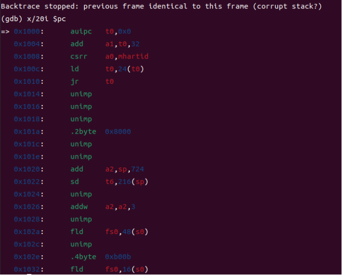
Grep一下汇编代码发现没有对应的输出：
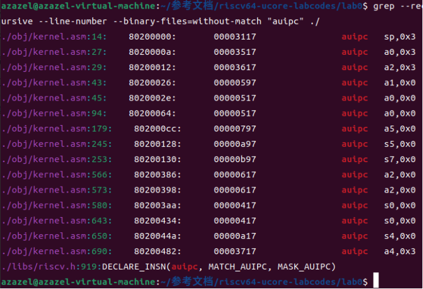
指令：`grep --recursive --line-number --binary-files=without-match "auipc" ./`
--recursive（或 -r）：递归搜索子目录。
--line-number（或 -n）：显示匹配行的行号。
--binary-files=without-match：当文件中没有匹配项时，不显示二进制文件的内容。
"auipc"：要搜索的字符串。
./：当前目录的路径，表示从当前目录开始搜索。
综合以上信息，说明现在执行的程序既不是已有的C程序，也不是已有的汇编代码（后缀为.S的程序）。可以由上面执行的make命令合理猜测从加电到0x80200000执行的代码在ucore.img。这段程序所实现的功能应该有：切换到保护模式，启用分段机制，把控制权交给ucore操作系统等等。 

在0x80200000设置断点可以看到在./kern/init/entry.S触发了断点。
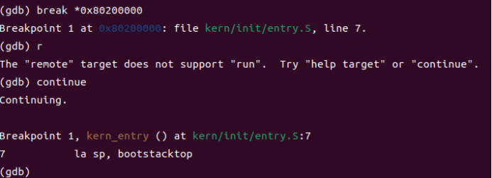
现在backtrace可以正常使用：

至此调试联系基本完成。

### 列出你认为本实验中重要的知识点，以及与对应的OS原理中的知识点，并简要说明你对二者的含义，关系，差异等方面的理解（也可能出现实验中的知识点没有对应的原理知识点）：

这次实验搭建了实验环境，学习了qemu和gdb的基础使用，概述内核如何启动和运行第一个进程。这和OS原理中的引导过程，内核初始化，进程调度，上下文切换等知识点有关。

### 列出你认为OS原理中很重要，但在实验中没有对应上的知识点：
没有内核空间到用户空间的转换的内容。

## lab1
### 练习1：理解内核启动中的程序入口操作
阅读 kern/init/entry.S内容代码，结合操作系统内核启动流程，说明指令 la sp, bootstacktop 完成了什么操作，目的是什么？ tail kern_init 完成了什么操作，目的是什么？

la sp, bootstacktop：将返回地址保存在sp寄存器中。这样做的目的是为了确保程序的栈将从 bootstacktop 处开始，而内核会使用栈来执行其内部功能以及处理中断和异常。
tail kern_init：调用函数kern_init，这个函数打印了一个字符串之后就进入循环。目的可能是为了确保内核初始化代码在启动时可以使用整个初始栈，这可以提高栈空间的利用效率，并且通常在启动时非常重要，因为内核需要大量的栈空间来执行初始化和处理各种任务。

### 练习2：完善中断处理 （需要编程）
请编程完善trap.c中的中断处理函数trap，在对时钟中断进行处理的部分填写kern/trap/trap.c函数中处理时钟中断的部分，使操作系统每遇到100次时钟中断后，调用print_ticks子程序，向屏幕上打印一行文字”100 ticks”，在打印完10行后调用sbi.h中的shut_down()函数关机。

要求完成问题1提出的相关函数实现，提交改进后的源代码包（可以编译执行），并在实验报告中简要说明实现过程和定时器中断中断处理的流程。实现要求的部分代码后，运行整个系统，大约每1秒会输出一次”100 ticks”，输出10行。

完整代码如下：
```c
case IRQ_S_TIMER:
            // "All bits besides SSIP and USIP in the sip register are
            // read-only." -- privileged spec1.9.1, 4.1.4, p59
            // In fact, Call sbi_set_timer will clear STIP, or you can clear it
            // directly.
            // cprintf("Supervisor timer interrupt\n");
             /* LAB1 EXERCISE2   YOUR CODE :  */
            /*(1)设置下次时钟中断- clock_set_next_event()
             *(2)计数器（ticks）加一
             *(3)当计数器加到100的时候，我们会输出一个`100ticks`表示我们触发了100次时钟中断，同时打印次数（num）加一
            * (4)判断打印次数，当打印次数为10时，调用<sbi.h>中的关机函数关机
            */
            clock_set_next_event();
            ticks++;
            if(ticks%TICK_NUM==0)
            {
                ticks=0;
                cprintf("100ticks\n");
                ++num;
            }
            if(num==10)
            {
                sbi_shutdown();
            }
            break;
```
这里再给出另一个同学的代码：  
```c
case IRQ_S_TIMER:
            clock_set_next_event();
            ticks++;
            if(ticks%100==0){
                print_ticks();
                num++;
            }
            if(num==10){
                sbi_shutdown();
            }
            break;
```
其实没什么大的区别。

基本上按照注释一步一步做就可以，具体的思路：
>1. 阅读中断与中断处理流程，了解中断分为异常(Exception)、中断(Interrupt)两种
>2. 开始着手完成trap函数的编写，查看trap函数：`void trap(struct trapframe *tf) { trap_dispatch(tf); }`只有这简单的一行，函数中调用了trap_dispatch函数，查看其定义：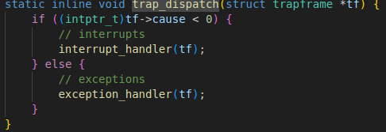
实际上就是把中断处理,异常处理的工作分发给了interrupt_handler()，exception_handler(), （分发的判定是根据scause的最高位，最高位是1，即负数，说明trap是由中断引起的）这些函数再根据中断或异常的不同类型来处理。
>3. 现在转到interrupt_handler函数，发现是简单地根据scause的数值更仔细地分了下类，现在主要关注时钟中断的处理，即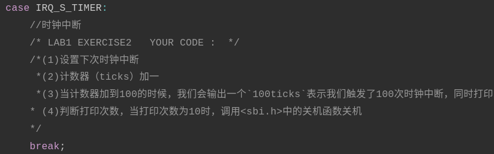
根据这些注释，就可以很简单的完成任务。

实验结果：
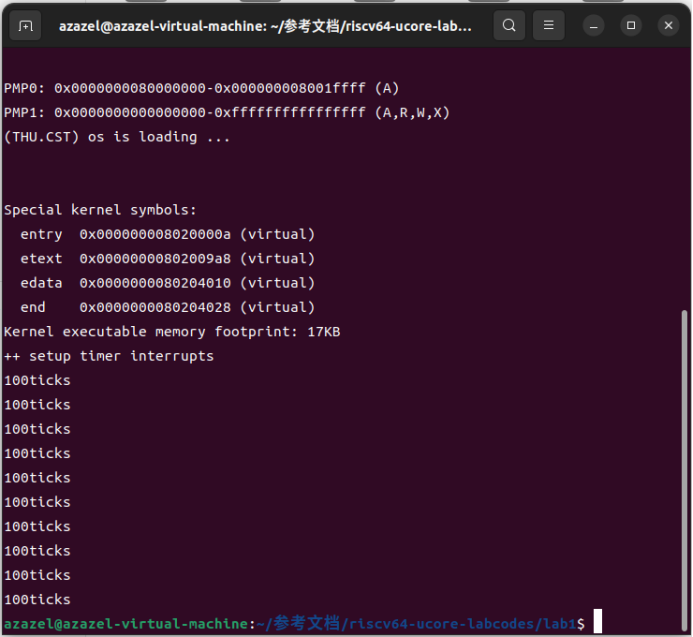
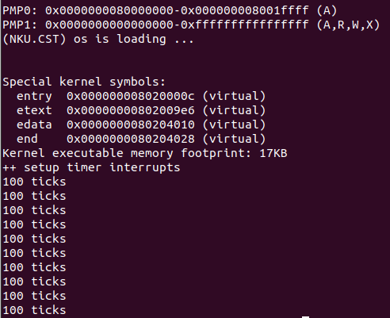

### 扩展练习 Challenge1：描述与理解中断流程

回答：描述ucore中处理中断异常的流程（从异常的产生开始），其中mov a0，sp的目的是什么？SAVE_ALL中寄寄存器保存在栈中的位置是什么确定的？对于任何中断，__alltraps 中都需要保存所有寄存器吗？请说明理由。

流程：
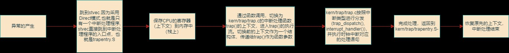
mov a0，sp是lab1/kern/trap/trapentry.S中的一条命令，目的是传递当前栈帧的信息，以便后续的代码能够访问和处理栈上的数据，将a0寄存器传递参数给接下来调用的函数trap。
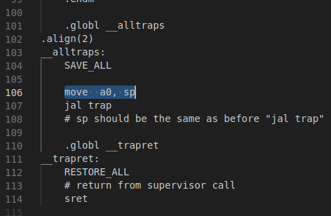

### 扩展练习 Challenge2：理解上下文切换机制

回答：在trapentry.S中汇编代码 csrw sscratch, sp；csrrw s0, sscratch, x0实现了什么操作，目的是什么？save all里面保存了stval scause这些csr，而在restore all里面却不还原它们？那这样store的意义何在呢？

>`csrw sscratch, sp`：保存原先的栈顶指针到sscratch，确保中断处理程序能够正确地保存和还原上下文信息，支持递归的中断处理，并提高安全性，以防止信息泄漏。
`csrrw s0, sscratch, x0`:RISCV不能直接从CSR写到内存, 需要csrr把CSR读取到通用寄存器s0，再从通用寄存器存储到内存

>* scause，它会记录中断发生的原因，还会记录该中断是不是一个外部中断；
>* stval，它会记录一些中断处理所需要的辅助信息，比如指令获取(instruction fetch)、访存、缺页异常，它会把发生问题的目标地址或者出错的指令记录下来，这样我们在中断处理程序中就知道处理目标了。
下面这些异常处理情况下，这些寄存器的值可能不需要还原，而是需要保留在其异常状态下。例如：
>>1. 异常处理程序可能需要检查异常的原因和导致异常的指令的值，以确定如何正确地处理异常。在这种情况下，保留 stval 和 scause 寄存器的值有助于异常处理程序进行适当的决策。
>>2. 异常处理程序可能需要将异常信息传递给更高级别的异常处理程序或操作系统内核，以进行更深入的处理。在这种情况下，不还原 stval 和 scause 寄存器的值有助于保持异常信息的完整性。
>>3. 在某些异常处理场景中，可能会决定不恢复到正常执行状态。例如，在操作系统内核的异常处理程序中，如果发生了致命的内核错误，可能会决定终止当前任务或重启系统，而不是尝试继续正常执行。

### 扩展练习Challenge3：完善异常中断

编程完善在触发一条非法指令异常 mret和ebreak ,在 kern/trap/trap.c的异常处理函数中捕获，并对其进行处理，简单输出异常类型和异常指令触发地址，即“Illegal instruction caught at 0x(地址)”，“ebreak caught at 0x（地址）”与“Exception type:Illegal instruction"，“Exception type: breakpoint”。

实现代码：
```c
case CAUSE_ILLEGAL_INSTRUCTION:
             // 非法指令异常处理
             /* LAB1 CHALLENGE3   YOUR CODE :  */
            /*(1)输出指令异常类型（ Illegal instruction）
             *(2)输出异常指令地址
             *(3)更新 tf->epc寄存器
            */
            cprintf("Exception type:Illegal instruction\n");
            cprintf("Illegal instruction caught at %d\n",tf->epc);
            tf->epc+=4;
            break;
        case CAUSE_BREAKPOINT:
            //断点异常处理
            /* LAB1 CHALLLENGE3   YOUR CODE :  */
            /*(1)输出指令异常类型（ breakpoint）
             *(2)输出异常指令地址
             *(3)更新 tf->epc寄存器
            */
            cprintf("Exception type: breakpoint\n");
            cprintf("breakpoint caught at %d\n",tf->epc);
            tf->epc+=2;
            break;
```
在init.c的`kern_init`函数中添加
```c
asm volatile("ebreak");
asm volatile("mret");
```
这是2条内联汇编指令，指令1用于触发一个断点异常，指令2用于从机器级别（Machine Mode）返回到先前的特权级别。
代码运行结果：
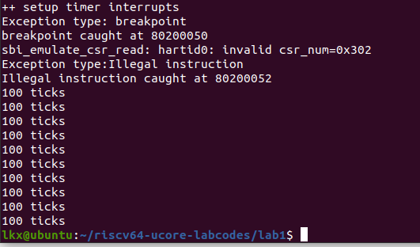

### 列出你认为本实验中重要的知识点，以及与对应的OS原理中的知识点，并简要说明你对二者的含义，关系，差异等方面的理解（也可能出现实验中的知识点没有对应的原理知识点）：
**定时器中断中断处理的流程：**
系统使用定时器中断来维持其时钟。定时器中断来自附加到每个RISC-V CPU上的时钟硬件。系统对该时钟硬件进行编程，以定期中断每个CPU。
RISC-V要求定时器中断在机器模式而不是管理模式下进行。RISC-V机器模式无需分页即可执行，并且有一组单独的控制寄存器。

通过本次实验理解了定时器中断的运作，理解了内核启动中的程序入口操作。
这和OS原理中的中断处理，时钟中断，时钟管理，中断控制器等知识点有关。

### 列出你认为OS原理中很重要，但在实验中没有对应上的知识点：
本次实验只涉及了定时器中断，对于一般的陷阱机制没有太多涉及。

            


