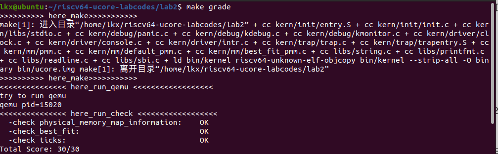

# lab2
## 练习1：理解first-fit 连续物理内存分配算法（思考题）

first-fit 连续物理内存分配算法作为物理内存分配一个很基础的方法，需要同学们理解它的实现过程。请大家仔细阅读实验手册的教程并结合kern/mm/default_pmm.c中的相关代码，认真分析default_init，default_init_memmap，default_alloc_pages， default_free_pages等相关函数，并描述程序在进行物理内存分配的过程以及各个函数的作用。 请在实验报告中简要说明你的设计实现过程。

### default_init
进行初始化：free_list用于记录空闲内存块，nr_free是空闲内存块的总数。

### default_init_memmap
default_init_memmap函数完成了对空闲块的初始化，并将其插入到空闲列表中的适当位置。

### default_alloc_pages
用于分配连续的页的函数，并返回第一个页的地址。

### default_free_pages
用于释放连续的页的函数。

## 练习2：实现 Best-Fit 连续物理内存分配算法（需要编程）

在完成练习一后，参考kern/mm/default_pmm.c对First Fit算法的实现，编程实现Best Fit页面分配算法，算法的时空复杂度不做要求，能通过测试即可。 请在实验报告中简要说明你的设计实现过程，阐述代码是如何对物理内存进行分配和释放.

### 代码实现

### 结果展示

### 分配和释放
分配：它会从空闲页块链表中找到大小最适合的空闲页块，然后进行分配。这里的最合适是指该页面的property是大于等于所需要的property里最小的。
释放：它会将释放的页面添加回链表，并在必要时合并相邻的空闲页块，以最大限度地减少内存碎片。

### 问题：你的 Best-Fit 算法是否有进一步的改进空间？
有，在分配时，如果找到一个和需要的大小正好相等的空闲页块时，无需再进行后续的查找，可以直接跳出循环。

## 如果 OS 无法提前知道当前硬件的可用物理内存范围，请问你有何办法让 OS 获取可用物理内存范围？
1. 往内存中写入并读取数据，如果超过了内存的范围，那么不管你写入什么再读取都会返回零
2. 利用BIOS中断功能，BIOS中断提供一个检索内存的功能，会返回一个结构体到你指定的位置
3. 使用物理内存映射寄存器（Physical Memory Map）：某些处理器和芯片组提供了物理内存映射寄存器，这些寄存器中记录了系统中可用的物理内存范围。操作系统可以读取这些寄存器的值来获取可用的物理内存范围。
