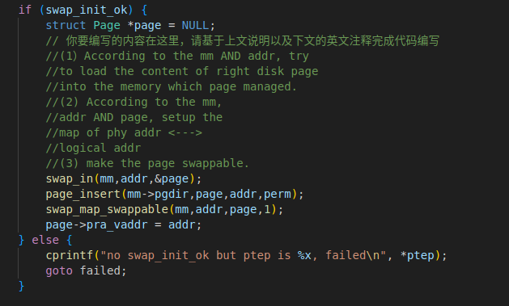
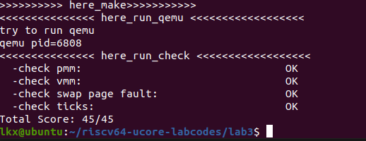

# lab3
## 练习1：理解基于FIFO的页面替换算法（思考题）

描述FIFO页面置换算法下，一个页面从被换入到被换出的过程中，会经过代码里哪些函数/宏的处理（或者说，需要调用哪些函数/宏），并用简单的一两句话描述每个函数在过程中做了什么？（为了方便同学们完成练习，所以实际上我们的项目代码和实验指导的还是略有不同，例如我们将FIFO页面置换算法头文件的大部分代码放在了kern/mm/swap_fifo.c文件中，这点请同学们注意）

   * 至少正确指出10个不同的函数分别做了什么？如果少于10个将酌情给分。我们认为只要函数原型不同，就算两个不同的函数。要求指出对执行过程有实际影响,删去后会导致输出结果不同的函数（例如assert）而不是cprintf这样的函数。如果你选择的函数不能完整地体现”从换入到换出“的过程，比如10个函数都是页面换入的时候调用的，或者解释功能的时候只解释了这10个函数在页面换入时的功能，那么也会扣除一定的分数

### alloc_pages——换入
// kern/mm/pmm.c
如果发现当前没有空闲的物理页可供分配并且此时试图得到空闲页时，我们才尝试换出页面到硬盘上。

### swap_in——换入
// kern/mm/swap.c
用于执行页面交换操作，它首先分配一个物理内存页，然后根据给定的虚拟地址和页表获取或构建相应的页表项，接着从硬盘读取数据到物理内存页中，最后将结果通过 ptr_result 返回给调用者。

### swap_out——换出
// kern/mm/swap.c
执行了页面置换操作，通过页面置换算法选择要换出的页面，并将它们写入硬盘上的交换文件。

### swapfs_read——换入
kern/fs/swapfs.c
调用底层的硬盘读取函数 ide_read_secs，以读取交换文件中的数据，然后将数据存储到指定的物理页面 page 中。

### swapfs_write——换出
kern/fs/swapfs.c
调用底层的硬盘写入函数 ide_write_secs，以将物理页面 page 中的数据写入硬盘上的交换文件中的特定位置。用于将不常用的数据从物理内存交换出去。

### swap_init
kern/mm/swap.c
用于初始化操作系统的交换机制，包括交换文件系统、页面置换算法的选择和初始化，以及其他相关的初始化操作。

### _fifo_init_mm
初始化了FIFO页面置换算法的相关数据结构

### _fifo_map_swappable——换入
将页面链接到链表的末尾，以维护页面的访问顺序。

### _fifo_swap_out_victim——换出
用于选择并返回按FIFO页面置换算法原则最早到达的页面作为受害者，同时解除链表中的链接，以准备将其替换出内存。

### 内核错误有关的宏
```c
/* kernel error codes -- keep in sync with list in lib/printfmt.c */
#define E_UNSPECIFIED       1   // Unspecified or unknown problem
#define E_BAD_PROC          2   // Process doesn't exist or otherwise
#define E_INVAL             3   // Invalid parameter
#define E_NO_MEM            4   // Request failed due to memory shortage
#define E_NO_FREE_PROC      5   // Attempt to create a new process beyond
#define E_FAULT             6   // Memory fault

/* the maximum allowed */
#define MAXERROR            6
```
>E_UNSPECIFIED (1)：表示未指定或未知的问题。这个错误代码通常用于指示发生了一些问题，但具体的问题类型未知。
E_BAD_PROC (2)：表示进程不存在或者因为某种原因无法访问进程。通常用于表示尝试操作一个不存在的进程或者无效的进程。
E_INVAL (3)：表示参数无效。这个错误代码通常用于指示传递给函数或操作的参数无效或不合法。
E_NO_MEM (4)：表示由于内存不足，请求的操作失败。通常用于表示内存分配或资源分配失败。
E_NO_FREE_PROC (5)：表示尝试创建一个新进程，但已经达到了系统中可以创建的最大进程数，因此无法创建更多的进程。
E_FAULT (6)：表示内存故障。通常用于指示访问或操作内存时发生了故障或错误。

### find_vma
kern/mm/vmm.c
用于在给定的进程内存管理结构中查找包含特定地址的虚拟内存区域（VMA），并且在查找时尝试使用缓存以提高性能。


## 练习2：深入理解不同分页模式的工作原理（思考题）

get_pte()函数（位于kern/mm/pmm.c）用于在页表中查找或创建页表项，从而实现对指定线性地址对应的物理页的访问和映射操作。这在操作系统中的分页机制下，是实现虚拟内存与物理内存之间映射关系非常重要的内容。

   * get_pte()函数中有两段形式类似的代码， 结合sv32，sv39，sv48的异同，解释这两段代码为什么如此相像。


### sv32，sv39，sv48的异同
:::alert-info

**页表层次结构：**

sv32：使用两级页表结构。具有一级页表（Page Directory）和二级页表（Page Table）。
sv39：使用三级页表结构。具有三级页表，分别是一级页表、二级页表和三级页表。
sv48：使用四级页表结构。具有四级页表，分别是一级页表、二级页表、三级页表和四级页表。
**虚拟地址空间大小：**

sv32：虚拟地址空间大小为 4 GB。
sv39：虚拟地址空间大小为 512 GB。
sv48：虚拟地址空间大小为 128 TB。
**页表项大小：**

sv32：页表项大小为 32 位，其中包含页面基址和一些标志位。
sv39：页表项大小为 64 位。
sv48：页表项大小为 64 位。
**页表项数量：**

sv32：每级页表有 1024 个项。
sv39：每级页表有 512 个项。
sv48：每级页表有 512 个项。
**物理地址空间大小：**

sv32：通常支持 32 位物理地址，最多 4 GB 物理内存。
sv39：通常支持 40 位物理地址，最多 1 TB 物理内存。
sv48：通常支持 48 位物理地址，最多 256 TB 物理内存。
**地址翻译层级：**

sv32：需要两级地址翻译，从虚拟地址到一级页表，然后到二级页表。
sv39：需要三级地址翻译，从虚拟地址到一级页表，然后到二级页表，最后到三级页表。
sv48：需要四级地址翻译，从虚拟地址到一级页表，然后到二级页表，再到三级页表，最后到四级页表。
:::
### 代码：
1. `pde_t *pdep1 = &pgdir[PDX1(la)];` 和 `pde_t *pdep0 = &((pde_t *)KADDR(PDE_ADDR(*pdep1)))[PDX0(la)];` 这两行代码分别用于获取一级页表项（PDE1）和二级页表项（PDE0）。这两行代码都使用了宏和函数来计算页表项的地址。

2. `PDX1(la)` 和 `PDX0(la)` 是用于计算页表项索引的宏，它们的具体实现取决于页表的层次结构（如sv32、sv39、sv48等）。根据不同的页表结构，这些宏会产生不同的值，用于在一级页表和二级页表中找到对应的页表项。

3. `PDE_ADDR` 用于获取页表项中存储的物理地址。`KADDR` 用于将物理地址转换为内核虚拟地址，以便访问页表。这两个函数也是通用的，不依赖于特定的页表结构。

4. `PTE_V`、`PTE_U`、`PTE_W` 等宏是用于设置页表项的标志位，如可访问标志、用户可访问标志、可写标志等。这些宏也是通用的，不依赖于特定的页表结构。

总的来说，这段代码的相似之处在于它们的结构和操作逻辑是通用的，不受特定页表结构的限制。这使得这段代码可以轻松地适应不同的页表层次结构，而不需要大规模的修改。这种通用性在处理不同的页表结构时非常有用，因为不同的CPU架构和操作系统可能使用不同的页表结构来管理内存。因此，这段代码可以作为一个通用的页表操作工具在各种情况下使用。

###    目前get_pte()函数将页表项的查找和页表项的分配合并在一个函数里，你认为这种写法好吗？有没有必要把两个功能拆开？
**优点：**
>简化接口：将查找和分配合并在一个函数中可以简化接口，使调用者只需调用一个函数来获取或分配页表项。这可以降低调用者的复杂性，减少了错误的可能性。
原子操作：合并查找和分配可以保证在多线程或多进程环境中的原子性操作。这避免了竞态条件和同步问题，使代码更加健壮。
性能：在某些情况下，合并操作可以提高性能，因为它减少了函数调用和内存分配的开销。

**缺点：**

>功能耦合：合并功能使函数具有较高的复杂性，因为它既要处理查找逻辑又要处理分配逻辑。这可能导致代码难以维护和理解。
功能不清晰：合并功能可能使函数的功能不够清晰，因为它既可以用于查找又可以用于分配。这可能导致代码的可读性下降。
不够灵活：有时，查找和分配页表项可能需要不同的处理逻辑，特别是当没有足够的可用页表项时。合并功能可能会限制对这些情况的处理。

拆分与否根据具体的实际情况决定。
## 练习3：给未被映射的地址映射上物理页（需要编程）

补充完成do_pgfault（mm/vmm.c）函数，给未被映射的地址映射上物理页。设置访问权限 的时候需要参考页面所在 VMA 的权限，同时需要注意映射物理页时需要操作内存控制 结构所指定的页表，而不是内核的页表。

请在实验报告中简要说明你的设计实现过程。请回答如下问题：

  * 请描述页目录项（Page Directory Entry）和页表项（Page Table Entry）中组成部分对ucore实现页替换算法的潜在用处。
    如果ucore的缺页服务例程在执行过程中访问内存，出现了页访问异常，请问硬件要做哪些事情？
        数据结构Page的全局变量（其实是一个数组）的每一项与页表中的页目录项和页表项有无对应关系？如果有，其对应关系是啥？
        
### 需要添加的代码：  


## 练习4：补充完成Clock页替换算法（需要编程）

通过之前的练习，相信大家对FIFO的页面替换算法有了更深入的了解，现在请在我们给出的框架上，填写代码，实现 Clock页替换算法（mm/swap_clock.c）。(提示:要输出curr_ptr的值才能通过make grade)

请在实验报告中简要说明你的设计实现过程。请回答如下问题：

  *  比较Clock页替换算法和FIFO算法的不同。

### 运行结果展示：

## 练习5：阅读代码和实现手册，理解页表映射方式相关知识（思考题）

如果我们采用”一个大页“ 的页表映射方式，相比分级页表，有什么好处、优势，有什么坏处、风险？
**好处和优势：**

1. **减少页表项数量**：一个大页可以映射更多的物理地址范围，因此需要更少的页表项来管理相同数量的内存。这降低了页表的大小，减少了内存开销。

2. **快速地址转换**：由于页表更小，地址转换速度更快。大页可以减少页表的深度，减少了多级页表的查找层级，从而减少了内存访问所需的时间。

3. **减少TLB缺失**：TLB（Translation Lookaside Buffer）是用于存储最近使用的页表项的高速缓存，较少的页表项意味着更少的TLB缺失，提高了内存访问效率。

4. **适用于大内存块**：大页适用于需要大块连续内存的应用，例如数据库管理系统、虚拟机监控器、科学计算等。大页可以提高对大数据块的访问效率。

**坏处和风险：**

1. **内部碎片**：大页可能导致内部碎片，因为如果内存分配不是精确匹配大页大小的倍数，就会浪费一些内存空间。这可能导致内存浪费。

2. **不适用于小内存块**：大页对于小内存块的效率并不高，因为如果一个小内存块只使用大页中的一部分，就会浪费内存。

3. **不适用于稀疏地址空间**：大页通常不适用于稀疏地址空间，因为大页要求内存分配和地址映射是紧凑的，不适合存在大量空闲或不规则分布的地址空间的情况。

4. **更难管理**：大页可能增加了内存管理的复杂性，特别是在涉及内存分配和释放时，需要更谨慎地管理大页的使用。

